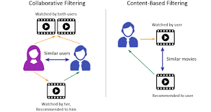

# Data Science: Phase 4 Project

# Filmfusion Movie Recommender System 

---

- **Group 17**
- Student names:
  - Allan Kiplagat
  - Esther Njagi
  - Benedict Kuloba
- Student pace: **Full time**
- Scheduled project review date/time: [To be added]
- Instructor name: **Asha Deen**

---

## Table of Contents:

- [Data Science: Phase 4 Project](#data-science-phase-4-project)
- [Filmfusion Movie Recommender System](#filmfusion-movie-recommender-system)
  - [Table of Contents:](#table-of-contents)
  - [Overview](#overview)
  - [Business and Data Understanding](#business-and-data-understanding)
    - [Objective](#objective)
  - [Modelling](#modelling)
  - [Conclusion and Recommendations](#conclusion-and-recommendations)
  - [Authors :people\_holding\_hands:](#authors-people_holding_hands)
  - [Technologies Used :gear:](#technologies-used-gear)
  - [Streamlite to deploy our model](#streamlite-to-deploy-our-model)

## Overview

**Objective:**
The goal of this project is to design and implement a movie recommender system that provides personalized recommendations to users based on their preferences and viewing history. The system employs various collaborative and content-based filtering techniques to enhance the accuracy and relevance of movie suggestions.

**Key Components:**

1. **Data Collection:**
   - Utilized a movie dataset containing information about movies, genres, user ratings, and tags.
   - Explored and cleaned the dataset to prepare it for modeling.

2. **Exploratory Data Analysis (EDA):**
   - Analyzed the dataset to understand its structure, features, and distributions.
   - Visualized key patterns, such as user preferences and movie popularity, to gain insights.

3. **Content-Based Filtering:**
   - Implemented a content-based recommender system using movie genres.
   - Used TF-IDF vectors to represent movie content and calculate similarities.

4. **Neighborhood-Based Collaborative Filtering (KNN):**
   - Implemented a neighborhood-based collaborative filtering model using SciKit Learn's KNN.
   - Explored both user-based and item-based collaborative filtering approaches.
   - Evaluated the model's performance using metrics such as RMSE and MAE.

5. **Model-Based Collaborative Filtering (SVD):**
   - Implemented a model-based collaborative filtering approach using the Surprise library and Singular Value Decomposition (SVD).
   - Evaluated the model's performance and explored hyperparameter tuning.

6. **Hybrid Approach:**
   - Recommended a hybrid model that combines the strengths of content-based and collaborative filtering approaches.
   - Highlighted the potential benefits of leveraging both user-item interactions and content features.

## Business and Data Understanding

### Objective

The primary objective of the recommender system project is to enhance user satisfaction and engagement on the MovieLens platform by delivering personalized and relevant movie recommendations. The recommender system aims to provide users with tailored suggestions based on their historical movie ratings and tagging activities, ultimately improving their overall experience.

## Modelling

For this project, we explored the following models:

1. **Unpersonalized Model**
2. **Content-Based Model**
3. **Collaborative Filtering Model**
   - **Neighborhood-Based (KNN)**
   - **Model-Based (Matrix Factorization)**
     - Singular Value Decomposition (SVD)

For the final model, we used the Neighborhood-Based model (KNN) as it had the lowest RMSE and MAE scores. We also explored the use of a hybrid model that combines the strengths of content-based and collaborative filtering approaches.

> **Note:** The code for the models can be found in the [notebooks](notebooks) folder.

## Conclusion and Recommendations

In developing a movie recommender system, we explored various approaches including content-based filtering, neighborhood-based collaborative filtering (KNN), and model-based collaborative filtering (SVD). Each approach had its strengths and limitations.

- **Content-Based Filtering:** Utilizing movie features such as genres, we built a content-based recommender. While it provided recommendations based on similarities in content, it might face challenges in capturing diverse user preferences.

- **Neighborhood-Based Collaborative Filtering (KNN):** The KNN model, implemented using SciKit Learn, proved effective in leveraging user-item interactions to make recommendations. The item-based variant, focusing on cosine similarity, demonstrated good performance in finding similar movies.

- **Model-Based Collaborative Filtering (SVD):** We explored the Surprise library to implement SVD, a matrix factorization technique. While SVD showed reasonable performance with an RMSE of 0.8925, its effectiveness could be influenced by hyperparameter tuning.

**Recommendation:**

- Considering the trade-offs between different approaches, we recommend a hybrid model that combines the strengths of content-based filtering and collaborative filtering. This hybrid approach can leverage the detailed user-item interactions captured by collaborative filtering while incorporating content features for a more personalized and diverse recommendation.

- Additionally, further hyperparameter tuning and model evaluation, especially with a larger dataset, could enhance the performance of collaborative filtering techniques. Regular updates to the recommendation engine based on user feedback and evolving content can also contribute to its effectiveness over time.

- In conclusion, the choice of a recommender system depends on the specific requirements, user preferences, and the nature of the dataset. A well-balanced hybrid model, continually refined and validated, holds the potential to offer robust and accurate movie recommendations.

## Authors :people_holding_hands:

- [Allan Kiplagat](https://github.com/Allan-Kipkemei)
- [Esther Njagi](https://github.com/emukami2)
- [Benedict Kuloba](https://github.com/myles-G)

## Technologies Used :gear:

- Python 3.8.5
- SciKit Learn
- Surprise
- Pandas
- Numpy
- Matplotlib
- Seaborn
- Flask
- Joblib

## Streamlite to deploy our model

- Streamlit is an open-source app framework that allows you to create and share custom web apps for machine learning and data science projects. We have utilized Streamlit to deploy our machine learning model, enabling an interactive and user-friendly interface for users to input data and receive predictions in real-time. The simplicity and efficiency of Streamlit facilitate rapid deployment and ease of use, making it an excellent choice for showcasing our model's capabilities.

 - Key Features of Our Streamlit App:
Interactive User Interface: Users can easily input data through the web interface and receive instant predictions.
Real-Time Updates: The model processes user inputs and displays results immediately, providing a seamless user experience.
Easy to Deploy and Share
